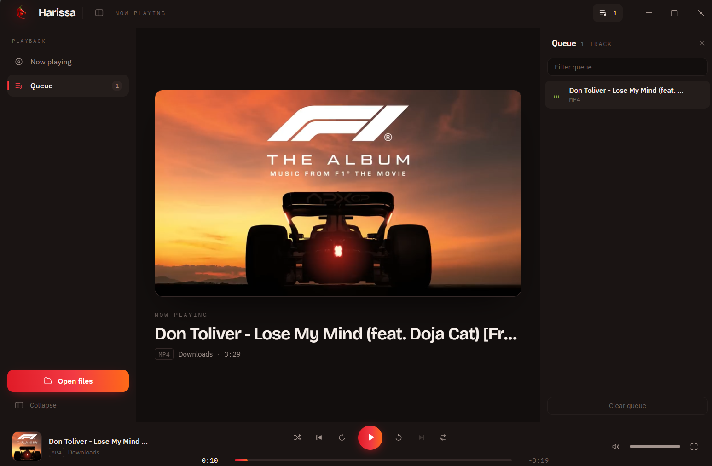

<div align="center">


# Harissa Media Player

**The spicy way to play.**

A small, free media player for Windows. Open your music or a video
and it plays. No account, no library to set up, nothing uploaded.

### [⬇ Download for Windows](https://github.com/Bechir-Lahoueg/Harissa-Media-Player/releases/download/v1.0.0/Harissa-Media-Player-Setup-1.0.0.exe)

Version 1.0.0 · Windows 10 and 11 (x64) · 107 MB · Free

</div>

---

## Download

| | |
| --- | --- |
| **Version** | 1.0.0 |
| **Platform** | Windows 10 and 11 (x64) |
| **File** | [`Harissa-Media-Player-Setup-1.0.0.exe`](https://github.com/Bechir-Lahoueg/Harissa-Media-Player/releases/download/v1.0.0/Harissa-Media-Player-Setup-1.0.0.exe) (107 MB) |
| **Price** | Free, open source |
| **All releases** | [Releases page](https://github.com/Bechir-Lahoueg/Harissa-Media-Player/releases) |

Check your download if you want to be sure it arrived intact:

```
SHA-256  b851ff9434602bc13afb3793b2fcaaeef1916bc5d7da1f21cb9ffb5c6a96b5ea
```

```powershell
Get-FileHash "Harissa-Media-Player-Setup-1.0.0.exe" -Algorithm SHA256
```

### Installing

1. Download the installer above.
2. Run it. Windows will warn you — see below.
3. Choose where to install it, or accept the suggested folder.
4. Open **Harissa Media Player** from the Start menu.

It installs for your user account only, so it never asks for administrator
rights. To remove it, use **Settings → Apps → Installed apps**.

> **Windows will say "Windows protected your PC".**
> Click **More info**, then **Run anyway**. The installer is not code-signed —
> a certificate costs money every year and Harissa does not have one yet. This
> is not a sign that anything is wrong with the file; verify the SHA-256 above
> if you want to be certain.
>
> On a clean Windows 11 machine, **Smart App Control** may block it outright
> with no way through. It only allows signed or well-known apps. If that
> happens, running from source is the way around it.

## What it looks like



## What Harissa does

| Feature | |
| --- | --- |
| Open local media | Standard Windows file dialog, multiple selection |
| Drag and drop | Drop files onto the window to open them |
| Open from Explorer | Right-click a file → **Open with** → Harissa. It does not take over your default player unless you tell it to |
| Audio formats | MP3, M4A, AAC, WAV, FLAC, OGG, OGA, Opus, WebA |
| Video formats | MP4, M4V, MKV, WebM, MOV, AVI, OGV |
| Queue | Open several files and they line up, with a filter, shuffle, and repeat off / all / one |
| Play and pause | Space, or the transport button |
| Seeking | Drag the progress bar, or jump 10 seconds with the arrow keys. Hold an arrow to scan |
| Jump to a timecode | Click the elapsed time and type where you want to be — `2:00`, `1:02:03`, or `90` |
| Volume and mute | 5% steps, and muting remembers your level |
| Fullscreen | Video fills the screen with its own controls. They fade out, along with the mouse pointer, after two seconds of stillness |
| Cover art | Artwork embedded in the file, or a still frame from the video |
| One window | Opening a second file hands it to the window already running |
| Your language | Follows the Windows display language. English, French, Arabic, Spanish and German are translated |
| Resizable window | Custom title bar, down to 900 × 560 |

A file plays when the codec inside it is one the media engine can decode. That
covers most everyday files — MP4 and MKV holding H.264, and the common audio
formats. Older containers such as AVI sometimes carry codecs it cannot read,
and Harissa says so rather than sitting silent.

### What it does not do

No accounts, no cloud, no streaming service, no analytics, and nothing running
in the background going through your folders.

Harissa reads the files you pick, from wherever they already are, and plays
them. Nothing is copied and nothing is uploaded. It works fine with the wifi
off.

## Keyboard shortcuts

| Keys | Action |
| --- | --- |
| `Space` | Play or pause |
| `←` / `→` | Back or forward 10 seconds, or hold to scan |
| `↑` / `↓` | Volume up or down |
| `M` | Mute or unmute |
| `N` / `P` | Next or previous track |
| `F` | Fullscreen (video) |
| `Esc` | Leave fullscreen |
| `Ctrl + O` | Open files |
| `Ctrl + B` | Show or hide the sidebar |
| `Ctrl + J` | Show or hide the queue |

## Run it from source

You need [Node.js](https://nodejs.org) 20.19 or newer and Git.

```bash
git clone https://github.com/Bechir-Lahoueg/Harissa-Media-Player.git
cd "Harissa-Media-Player/Desktop App"
npm install
npm run dev
```

To build the Windows installer yourself:

```bash
npm run dist
```

The result lands in `Desktop App/release/`.

## Built with

React 19 · TypeScript · Vite · Tailwind CSS · Electron

## Roadmap

Ideas for after V1, none of them commitments — broader codec support, saved
playlists, a media library, full track metadata, subtitles, playback speed,
resuming where you left off, deeper Windows integration, and a code-signed
installer so the warning above goes away.
